[Retour](partie_mécanique.md)  
[Page principale](README.md)

# Pièces

## Support

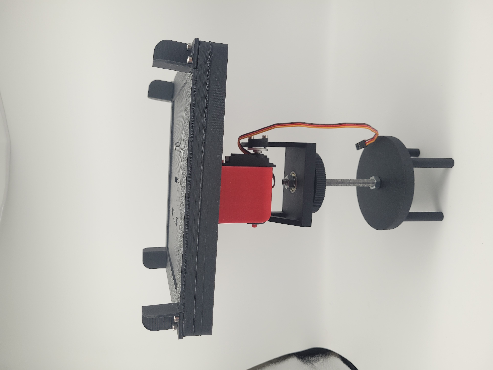

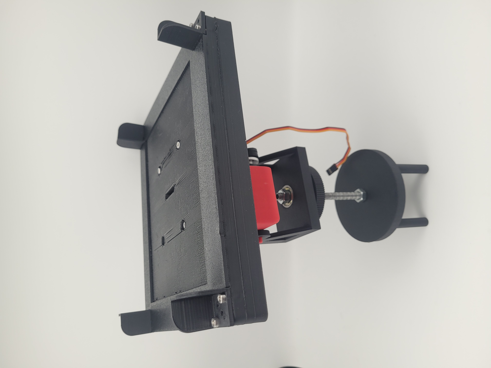

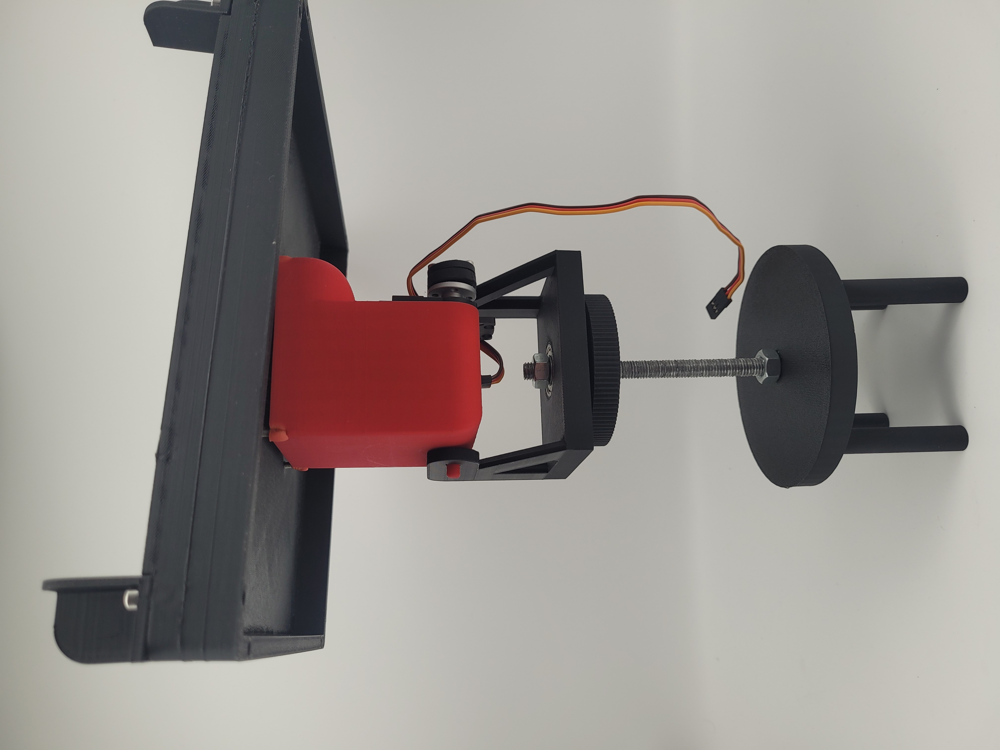

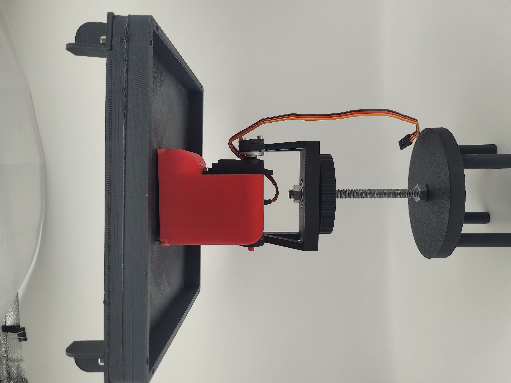

---

## Version 1 du support du plateau

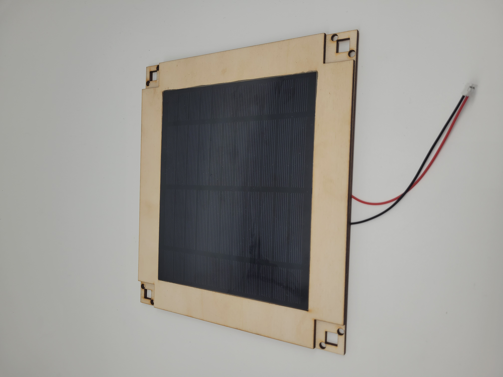

Support situé en dessous du plateau.

---

## Flip Ring

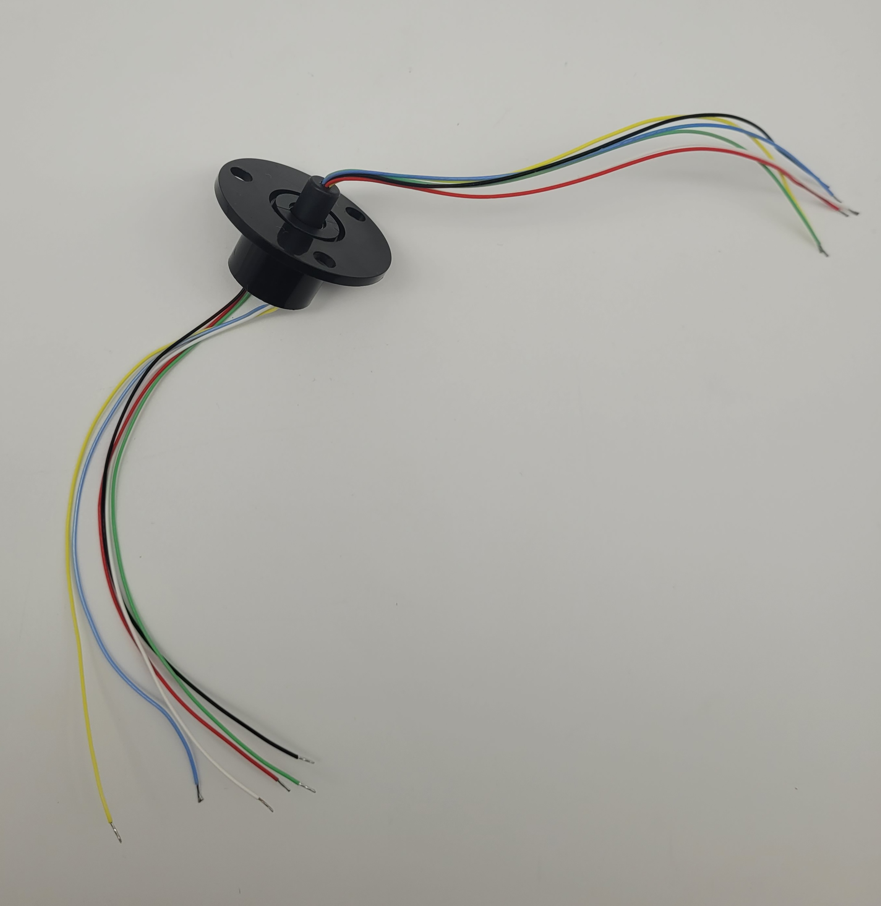

Le flip ring permet la rotation du système

---

## Engrenages de rotation

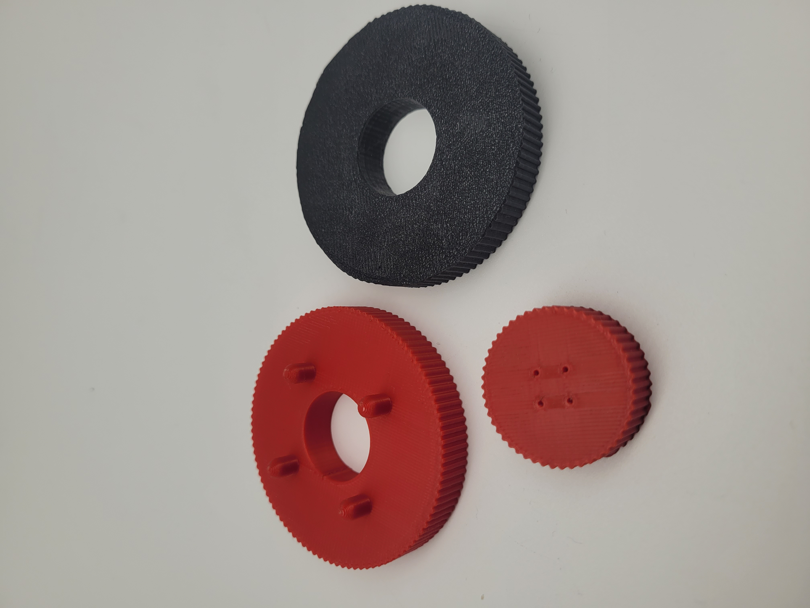

Engrenages permettant de faire tourner le panneau sur 360°.

---

## Fixation du moteur sous le panneau

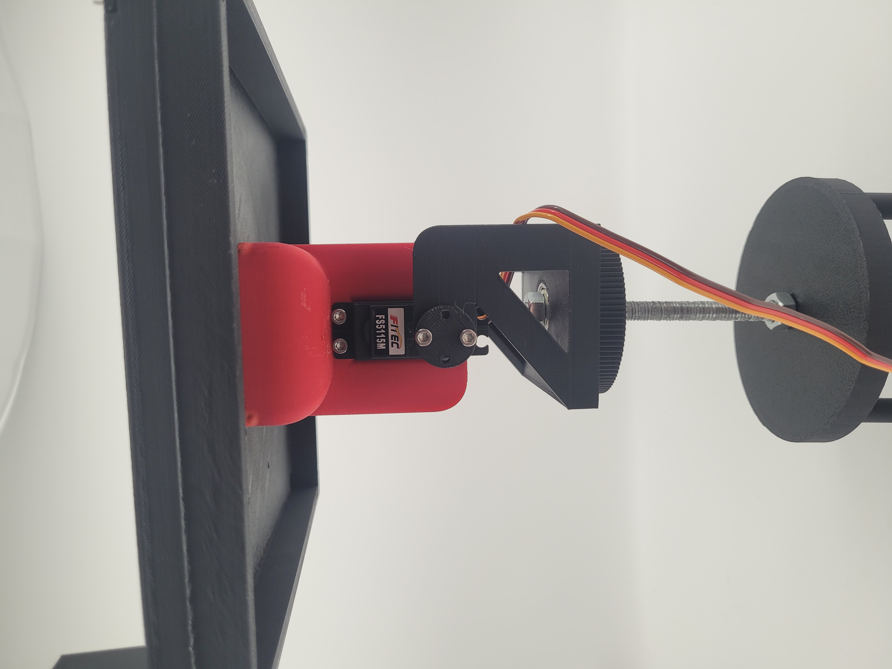
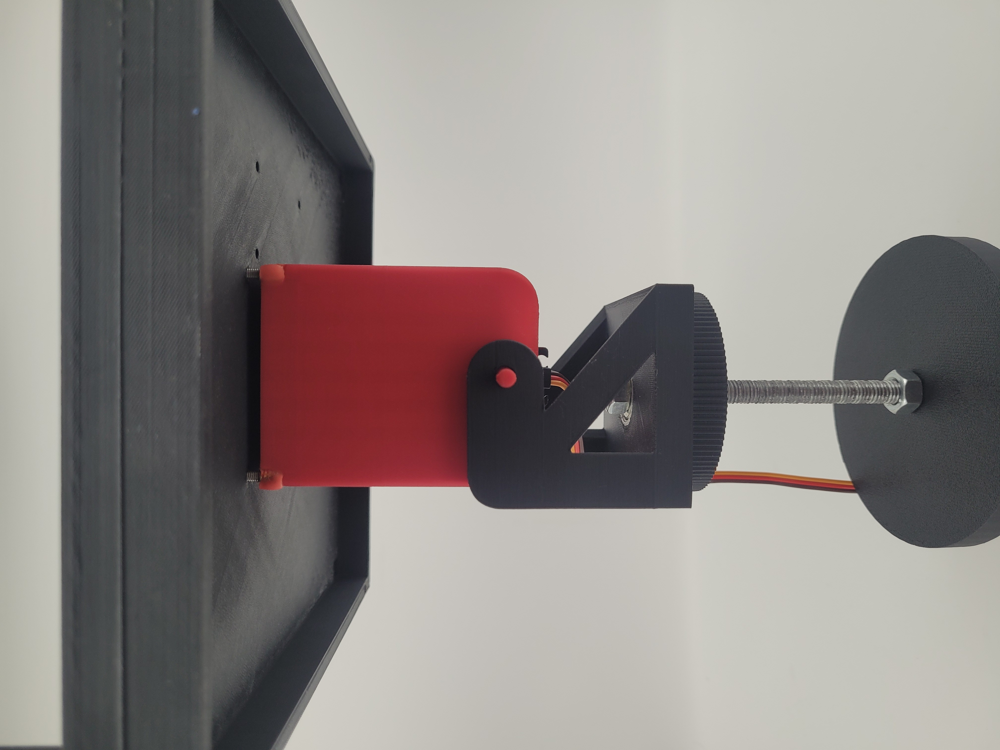

Maintient du moteurs en place.

---

## Accu et chargeur

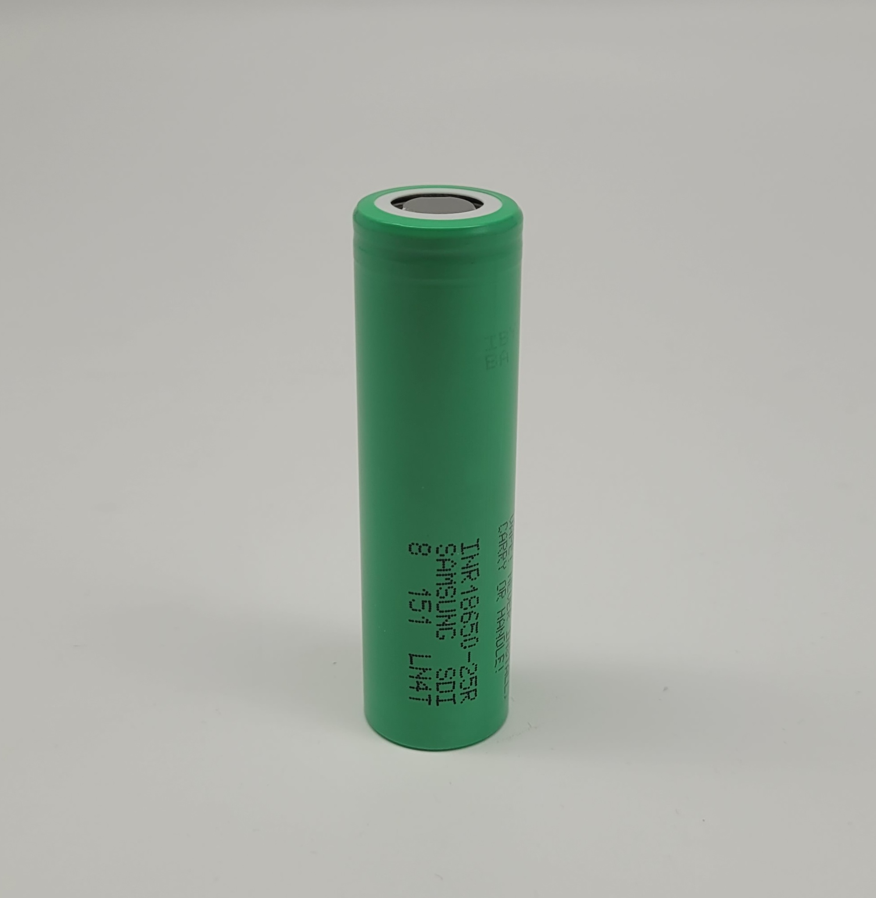
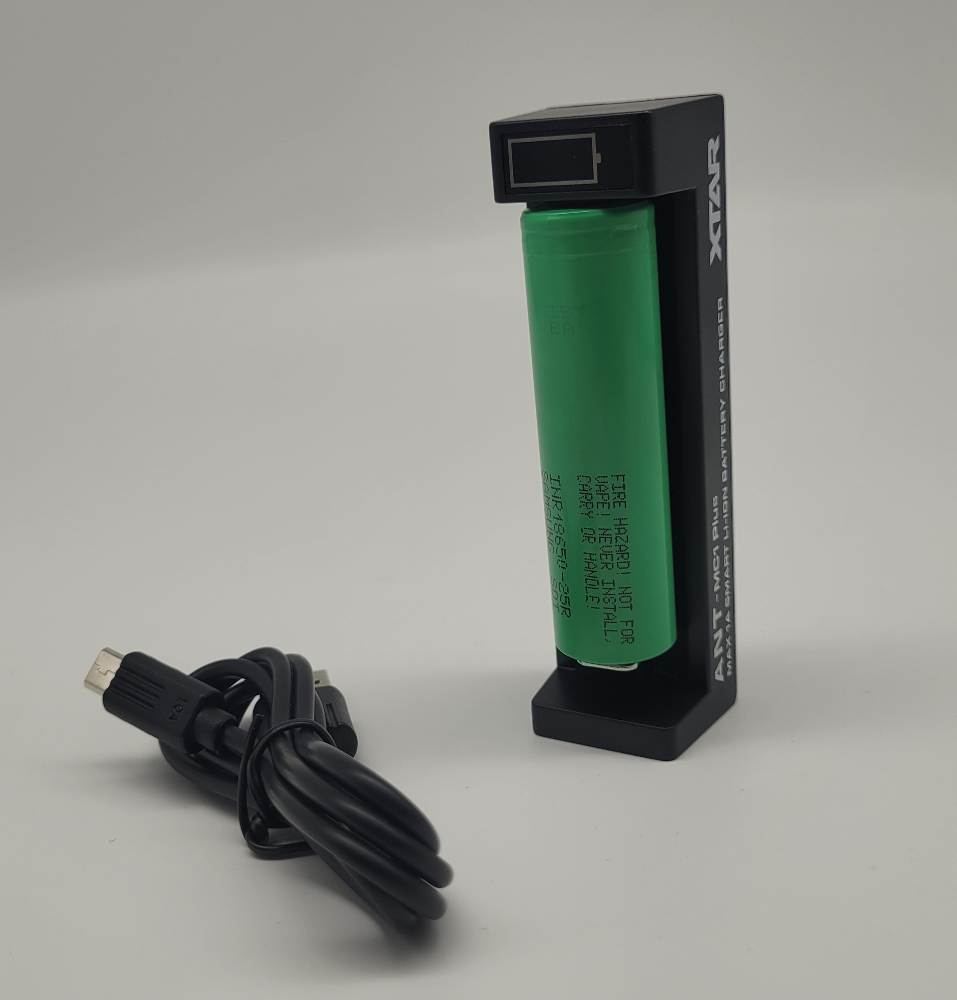

---

## Plaque

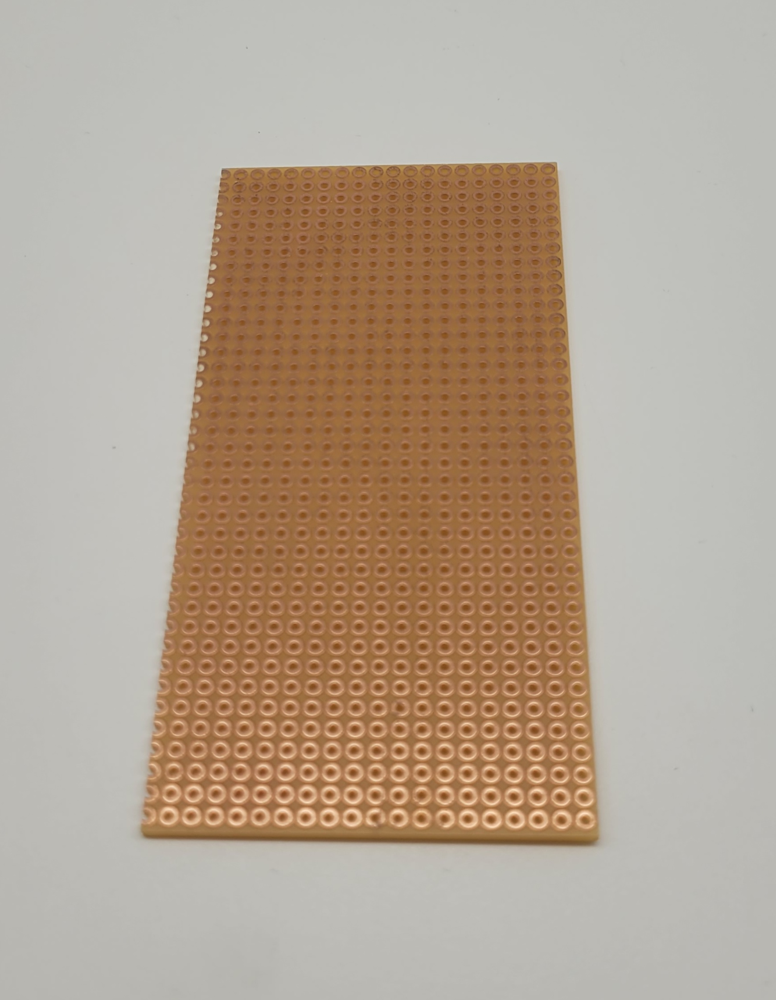

Plaque de cuivre qui sert de support afin de souder les éléments électroniques

---

## Avancement du montage

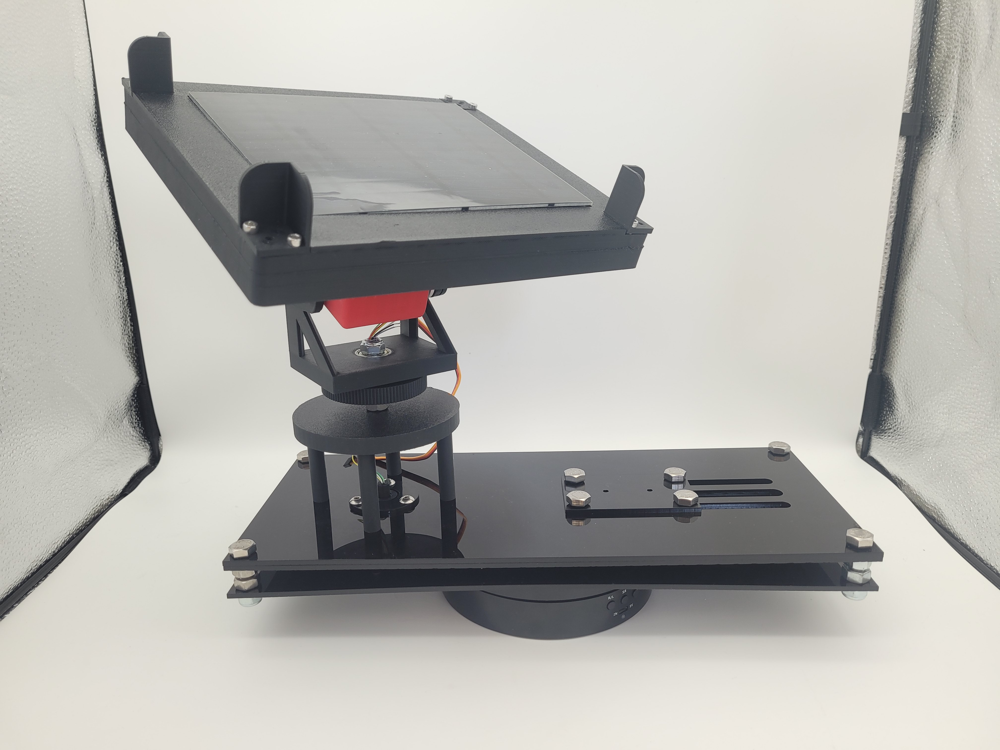

---

[Retour](partie_mécanique.md)  
[Page principale](README.md)
