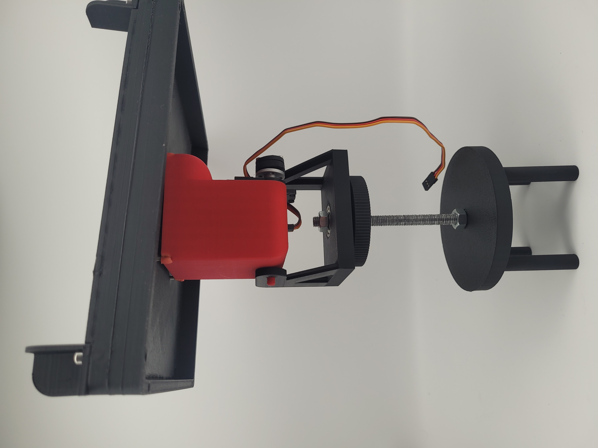
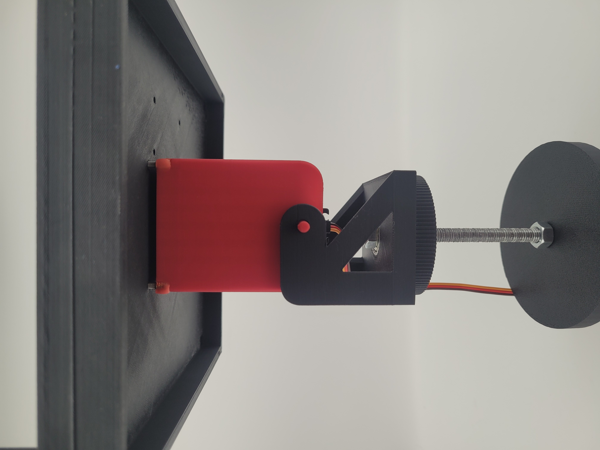

[Retour](partie_mécanique.md)

# Pièces & Assemblage

Dans cette section, nous présentons les différentes pièces mécaniques et électroniques qui composent notre système, ainsi que leur rôle respectif.

## Support

Le support constitue la base physique sur laquelle sont fixés les différents éléments du système. Il assure la stabilité de l’ensemble et permet de maintenir les pièces en place pendant le fonctionnement.

---

## Slip Ring

Le slip ring (ou collecteur tournant) permet de transmettre des signaux électriques d’une partie fixe à une partie en rotation continue. Dans ce projet, il est crucial pour permettre au panneau de tourner sur 360° sans emmêler ou casser les câbles électriques, assurant ainsi un mouvement fluide et constant.

---

## Engrenages de rotation

Les engrenages de rotation transmettent le mouvement du moteur vers le support du panneau. Ils permettent une rotation contrôlée et précise, sur 360°.

---

## Fixation du moteur sous le panneau

Cette pièce permet de fixer solidement le moteur sous le plateau du panneau photovoltaïque. Elle maintient le moteur en position, évitant tout déplacement ou vibration qui pourrait gêner le fonctionnement des engrenages ou désaligner le système.

[Retour](partie_mécanique.md)