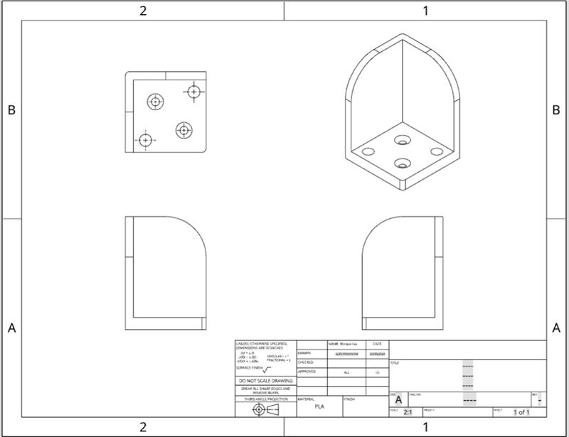
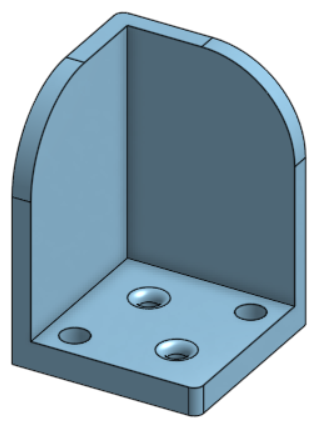
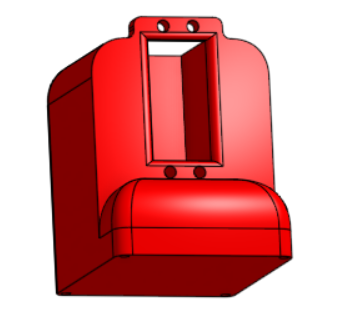
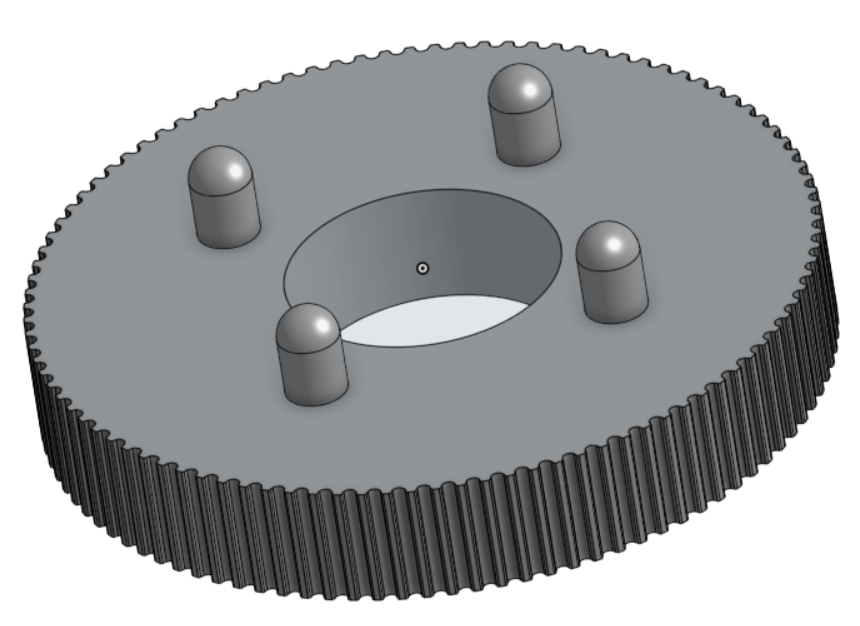
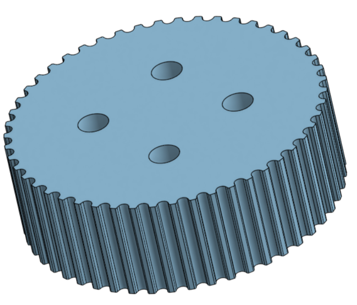
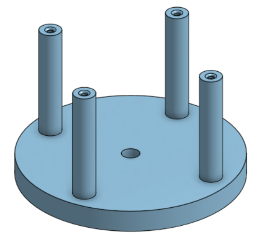
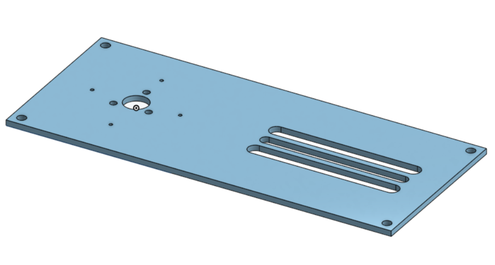
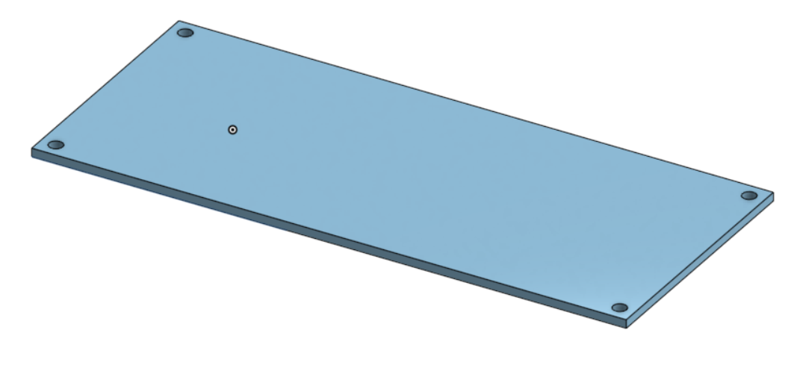

[Retour](etapes.md)  

# Etapes de conception & Modélisation

---

## Cache lumineux

Le cache lumineux est conçu pour bloquer la lumière qui vient de la direction opposée à la photorésistance. Cela permet de mesurer précisément l’intensité lumineuse dans la bonne direction, améliorant ainsi la précision du suivi solaire.

---

## Plateau pour panneau photovoltaïque

Ce plateau accueille le panneau photovoltaïque et le maintient solidement en place. Il assure une bonne stabilité et une orientation correcte du panneau pour capter un maximum de lumière.

---

## Fixation du moteur sous le plateau

Le moteur est inséré dans un support adapté, assurant qu’il reste bien en place pendant son fonctionnement.

Accroche pour maintenir le moteurs en place dans le support.

---

## Support sous le moteur

.png)

Le support sous le moteur sert à relier ce dernier aux engrenages de rotation. Il transmet ainsi le mouvement du moteur aux engrenages, qui vont permettre la rotation à 360° du panneau.

---

## Engrenages

Les engrenages sont des éléments mécaniques qui s’emboîtent pour transmettre et multiplier le mouvement du moteur. Ils permettent de faire tourner le panneau avec précision autour de son axe.

Engrenage emboité dans le support sous le moteur

Engrenages permettant de faire tourner le panneau

---

## Tabouret/Support

Le tabouret ou support est la base stable du système. Il soutient tout l’ensemble et garantit que les pièces restent bien alignées et stables.

---

## Plaque

Plaque d'acrylique en dessous du système, il y a un espace entre les deux, des vis les relient.

---

## Rendu Final

Le rendu final montre l’assemblage complet des différentes parties, illustrant comment chaque éléments se lient pour former un système cohérent, fonctionnel et stable.

---

[Retour](etapes.md)
