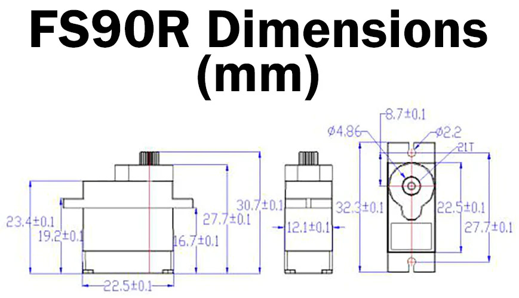

[Retour](partie_mécanique.md)

# Moteurs

## Moteur S-0008

Servomoteur S-0008

Data Sheet Servomoteur S-0008

## Moteur FS90R

Servomoteur FS90R

Dimensions du servomoteur FS90R

Ressource: 

## Caractéristiques: 

Alimentation: 4,8 à 6 Vcc. 

Course: 360° 

Couple: 
- 1,3 kg.com à 4,8 Vcc 
- 1,5 kg.cm à 6 Vcc 

Vitesse à vide: 
- 110 tr/min à 4,8 Vcc 
- 130 tr/min à 6 Vcc 

Dimensions: 23 x 12 x 28 mm 

Poids: 9 g 

Longueur du cordon: 20 cm 

Version: 2.0 

[Retour](partie_mécanique.md)