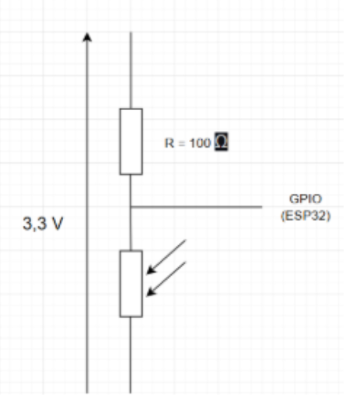
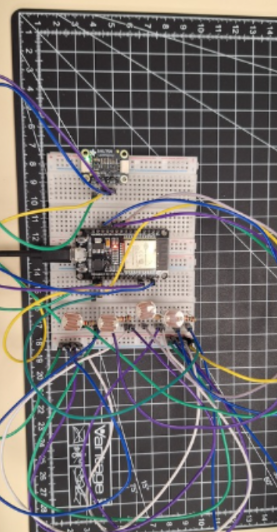

[Retour](partie_électronique.md)

## Solution pour suivre le soleil

Dans un système de suivi solaire, il est essentiel de déterminer la position du soleil pour orienter correctement le panneau. L’utilisation de quatre photorésistances aux quatre coins du panneau permet de comparer l’intensité lumineuse dans les directions principales : haut, bas, gauche et droite.

Si le panneau est mal orienté, la lumière ne sera pas uniforme sur les capteurs. Le système détecte alors la zone la plus lumineuse et ajuste l’orientation du panneau en conséquence.

Cette méthode est précise, économique et facile à implémenter sur une carte Arduino avec un algorithme simple. Elle fonctionne en temps réel, sans calculs complexes, ce qui simplifie le développement.

## Etude des capteurs

Nous avons réalisé une étude comparative entre les photorésistances et le capteur BH1750 afin de déterminer lequel serait le plus optimal pour un tracker solaire. L’objectif était d’évaluer à la fois la précision, la consommation énergétique et la complexité de chaque solution.

BH750

Le BH1750 offre une précision élevée pour mesurer l’intensité lumineuse en lux, mais il présente une consommation plus importante en raison de ses besoins en alimentation et de son fonctionnement via un bus I2C. De plus, il nécessite un traitement supplémentaire pour convertir les valeurs en orientations de panneaux, ce qui augmente la complexité du système.

## Photorésistances

Choix des photorésistances

En revanche, les photorésistances sont simples à utiliser, peu coûteuses et consomment très peu d’énergie. Leur précision est suffisante pour un suivi solaire, en permettant de détecter les variations de lumière entre les différentes zones du panneau. Elles sont faciles à intégrer sur une carte comme Arduino et nécessitent un algorithme de comparaison simple, ce qui réduit considérablement la complexité du projet.

Après cette analyse, nous avons opté pour les photorésistances. Elles offrent un bon compromis entre précision, faible consommation et simplicité d’implémentation, ce qui les rend plus adaptées à notre système de suivi solaire.

## Calibrage des photorésistances

Après avoir choisi les photorésistances, nous avons dû les calibrer. En effet, nous avons constaté des écarts importants entre les valeurs mesurées par les photorésistances et celles du capteur BH1750, pour la même intensité lumineuse.

Nous avons donc tracé des courbes représentant la tension du pont diviseur de chaque photorésistance en fonction des lux mesurés par le BH1750. Ces courbes nous ont permis de corriger les écarts et de mieux aligner les valeurs de la photorésistance avec les valeurs réelles de lumière.

Graphique représentant l’évolution de la tension (V) en fonction de l’éclairement (Lux) :

Schéma du pont diviseur :

Certains écarts entre les photorésistances et le capteur BH1750 étaient notables. Nous avons testé plusieurs solutions pour les corriger, comme l’utilisation de coefficients variables ou le changement de matériel. Cependant, après plusieurs essais, nous avons opté pour une solution plus simple : l’ajout d’une tolérance dans le code. Cette approche est plus facile à ajuster et permet de compenser les écarts de manière efficace sans complexifier le système.

Voici le circuit électronique pour la calibration des photorésistances :

