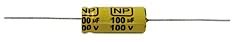

[Retour](partie_électronique.md)

# Condensateur

Condensateur chimique non polarisé à sorties axiales. 

## Caractéristiques :

Valeur: 100 µF. 
Tension de service: 100 V.

https://www.gotronic.fr/art-condensateur-bipolaire-100uf-100v-3353.htm  

Il sagit du condensateur en entrée pour stabiliser la tension du panneau  

[Retour](partie_électronique.md)