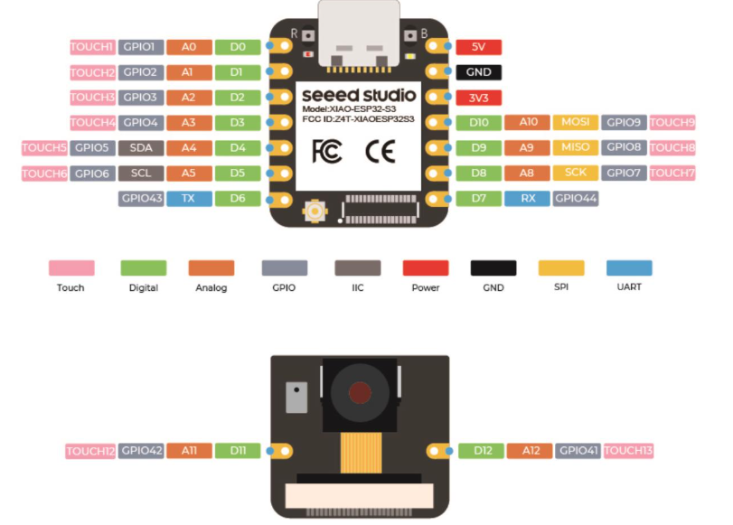

[Retour](partie_électronique.md)

# Composants électroniques

Cette section présente les composants et l'électronique utilisés dans le système.

## FS5103B

C’est un moteur à courant continu utilisé pour ses caractéristiques de couple élevé et de contrôle facile. Il est utilisé dans le système pour effectuer les ajustements d’orientation du panneau solaire.

## FS5115M

Un moteur pas-à-pas qui permet des mouvements précis et contrôlés. Il est utilisé pour ajuster avec précision la position du panneau solaire en réponse aux variations lumineuses.

## ESP32S3 XIAO

Une carte de développement ESP32S3 avec des capacités Wi-Fi et Bluetooth intégrées. Elle est utilisée pour gérer la communication, le traitement des données et le contrôle des servomoteurs.

<a href="https://wiki.seeedstudio.com/xiao_esp32s3_getting_started/">Voir ESP32S3</a>

## DIODE SCHOTTKY

Composant essentiel pour assurer une protection contre les inversions de polarité et alimenté les moteurs.

<a href="https://www.gotronic.fr/art-diode-schottky-2a-100v-47755.htm">Voir diode schottky</a>

## RESISTANCE

Composant passif utilisé pour le pont diviseur de tension. (100 à 1000 Ω).

## PHOTORESISTANCES

Capteurs de lumière utilisés pour mesurer l’intensité lumineuse et ajuster l’orientation du panneau solaire en fonction de la lumière reçue.

<a href="https://www.gotronic.fr/art-photoresistance-ldr1000-2152.htm">Voir photorésistance</a>

## BATTERIE

Fournit l'énergie nécessaire pour faire fonctionner le système.

(2A et 5V)

## BH1750

Un capteur de luminosité qui mesure l'intensité lumineuse en lux. Il sert à calibrer les photorésistances et à valider la précision des mesures de lumière.

<a href="https://learn.adafruit.com/adafruit-bh1750-ambient-light-sensor/pinouts">Voir BH1750</a>

## PANNEAU PHOTOVOLTAIQUE

Composant clé du système, il capte l'énergie solaire et la convertit en électricité pour alimenter le système.

<a href="https://www.gotronic.fr/art-cellule-solaire-sol3w-18996.htm">Voir panneau photovoltaique</a>

## SLIP RING

Utilisé pour assurer une connexion continue entre les parties mobiles et fixes du système, permettant aux servomoteurs de tourner sans interruption.

[Retour](partie_électronique.md)