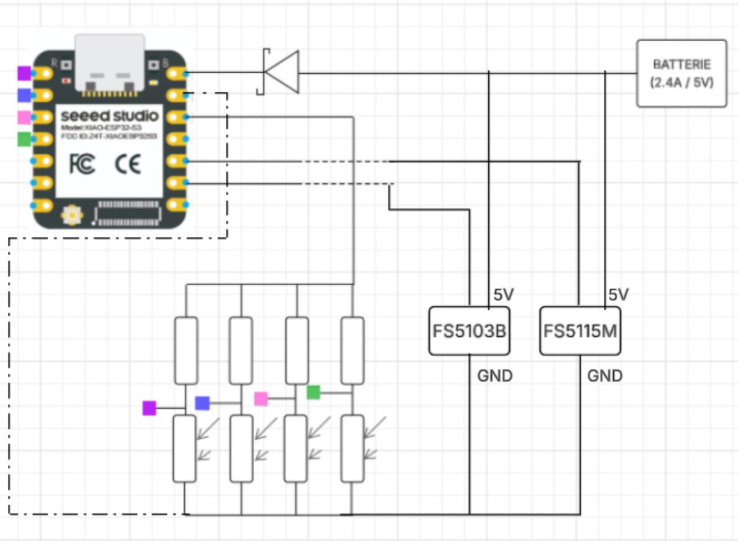

# Partie électronique

Cette partie présente le schéma électrique final du contrôle du tracking solaire, basé sur la carte ESP32 S3 XIAO. Il illustre les connexions entre les différents composants, tels que les servomoteurs, les photorésistances, et l'alimentation, permettant ainsi de contrôler l'orientation du panneau solaire.

1. Pour la réalisation sur PCB ou breadboard :

Le schéma électrique peut être facilement reproduit sur PCB ou breadboard. Cela permet de tester le système dans différentes configurations et de valider son bon fonctionnement avant une possible fabrication en série.

---

2. Pour le recalibrage des moteurs et photorésistances :

Il est nécessaire de recalibrer les moteurs et les photorésistances si les valeurs mesurées ne correspondent pas avec celles attendues dans le code. Ce recalibrage garantit une performance optimale du système de suivi solaire, en ajustant les paramètres selon les conditions réelles de fonctionnement.
