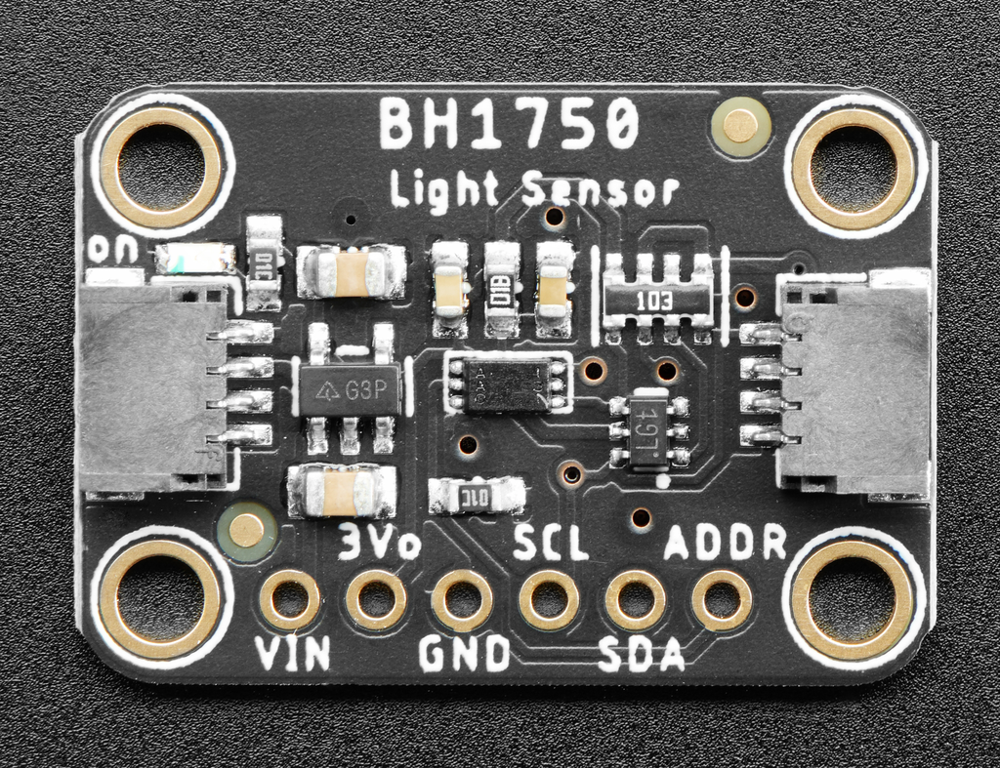

[Retour](partie_électronique.md)

# Capteur de lumière

Le capteur de lumière ambiante BH1750 est une alternative aux photoresistances/photodiodes à laquelle nous avons pensé et étudié.

https://learn.adafruit.com/adafruit-bh1750-ambient-light-sensor/pinouts

[Retour](partie_électronique.md)