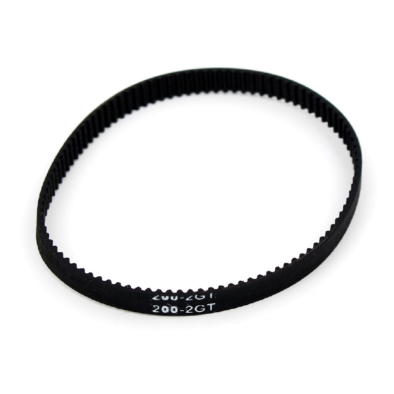
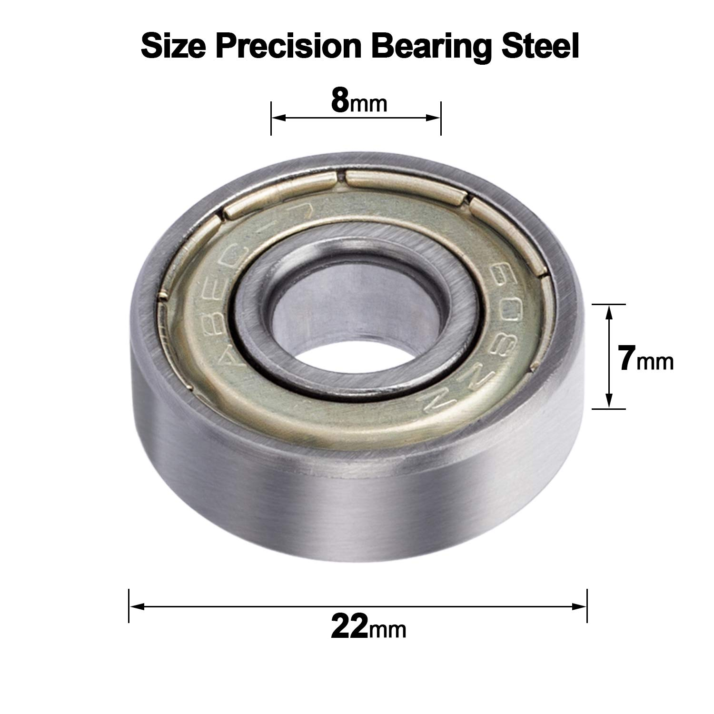
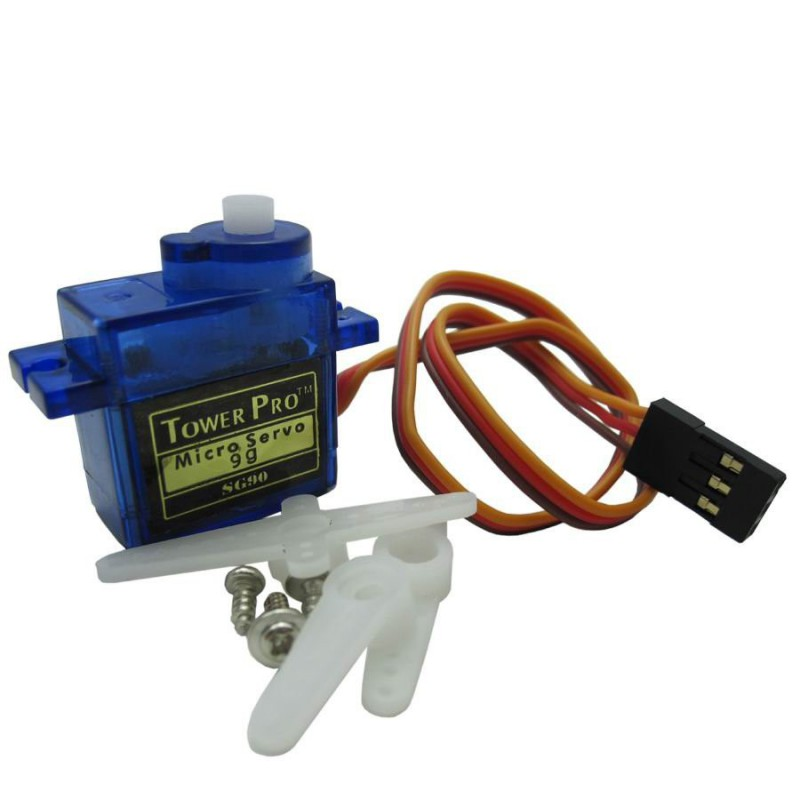

# Composants mécaniques utilisés

Dans ce projet, plusieurs composants mécaniques ont été choisis avec attention afin de garantir un mouvement fluide, précis et fiable du système de suivi solaire. Chaque élément a été sélectionné en fonction de sa fonction spécifique dans l’architecture du suiveur.

## Courroie GT2 (6 mm x 500 mm)

La courroie permet la transmission du mouvement entre le moteur et la structure mobile. Grâce à ses dents régulières, elle offre un déplacement fluide et sans glissement. Elle est utilisée ici pour assurer le mouvement de rotation de l’axe Y (horizontal) de manière souple et silencieuse.

## Moteur pas à pas 180° (axe Y)

Ce moteur est responsable du déplacement précis du panneau sur l’axe horizontal. Les moteurs pas à pas sont idéaux pour ce type d’application car ils permettent de contrôler finement l’angle de rotation, ce qui est essentiel pour suivre la position du soleil avec exactitude.

## Moteur continu (axe Z)

Le moteur continu est utilisé pour le mouvement sur l’axe vertical (ou Z), c’est-à-dire pour l’inclinaison du panneau. Il offre une rotation libre et adaptée à des ajustements plus souples. Ce type de moteur est moins précis qu’un moteur pas à pas, mais suffit pour des mouvements amples et non critiques.

## Roulements 608ZZ

Ces roulements sont utilisés pour assurer la rotation fluide de certaines parties mobiles du système. Ils permettent de réduire les frottements, d’assurer la stabilité des axes en rotation et d’augmenter la durabilité du mécanisme. Très courants dans les systèmes rotatifs, ils sont robustes et faciles à intégrer.

## Ancien moteur SG90 (non retenu)

Le moteur SG90 avait été envisagé initialement pour sa compacité, mais il s’est révélé trop instable et peu adapté aux contraintes du système. Il a été remplacé par des modèles plus fiables comme les FS5103B et FS5115M, offrant un meilleur couple et une meilleure précision.

## Visserie et fixation

Vis CHC M3 10 mm

Ces vis sont utilisées pour l’assemblage des différentes pièces mécaniques. Leur format standard M3 permet une fixation solide et compatible avec les inserts et pièces imprimées.

Inserts laiton M3 – 5,7 mm

Insérés dans les pièces en plastique (souvent imprimées en 3D), ces inserts permettent de visser et dévisser sans endommager la matière. Ils garantissent un montage propre, durable et démontable.

Ces composants mécaniques forment ensemble une base solide et fonctionnelle pour permettre au suiveur solaire de s’orienter correctement, avec précision et dans la durée. Leurs choix sont issus d’une réflexion technique prenant en compte les besoins de fiabilité, de précision et de facilité d’intégration.

Utilitaires :

VIS CHC M3 10mm Insert m3 5.7mm