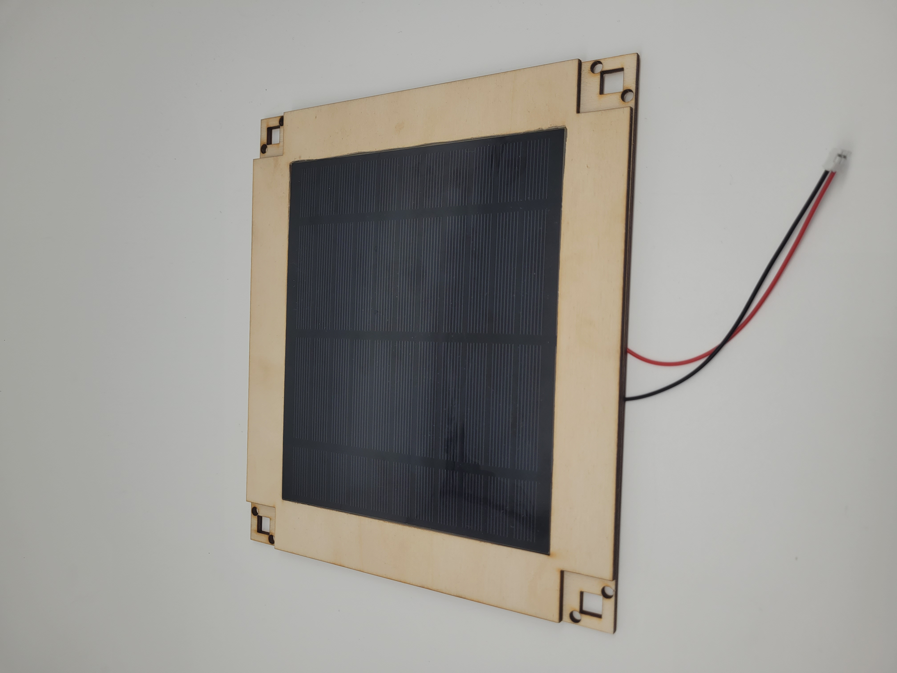

# Conception et prototypage

## Version 1 du support du plateau

Support situé en dessous du plateau. L’objectif de ce prototype était de tester l’ergonomie de fixation du panneau ainsi que les dimensions, et de réfléchir à la disposition des photorésistances aux quatre coins de celui-ci.

# Capteur de lumière

Le capteur de lumière ambiante BH1750 est une alternative aux photoresistances/photodiodes à laquelle nous avons pensé et étudié. Ce capteur numérique permet de mesurer précisément l’intensité lumineuse ambiante en fournissant une valeur directement exploitable, ce qui simplifierait le traitement des données. Contrairement aux photorésistances, qui nécessitent un calibrage et un traitement plus complexe pour obtenir des mesures fiables, le BH1750 offre une solution compacte et facile à intégrer. Nous avons étudié cette option afin de comparer les avantages et inconvénients des deux types de capteurs dans le contexte de notre système.

Les différences sont la précision et la complexité du traitement. Les photorésistances sont idéales pour un système simple et économique, tandis que le BH1750 offre une meilleure précision et une plus grande facilité de traitement mais cela a un coût plus élevé

https://learn.adafruit.com/adafruit-bh1750-ambient-light-sensor/pinouts