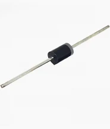

[Retour](partie_électronique.md)

# Diode

https://www.gotronic.fr/art-diode-schottky-2a-100v-47755.htm 

Un Zener limitera votre tension à 3,6 V, que la tension d'alimentation soit présente ou non. Le circuit de serrage avec les diodes shottky limitera la tension de -0,3 V à VCC+0,3 V. 

[Retour](partie_électronique.md)