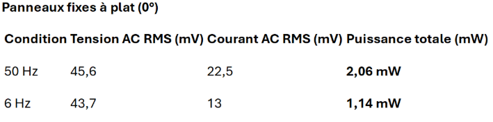
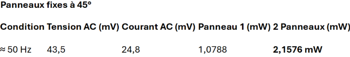
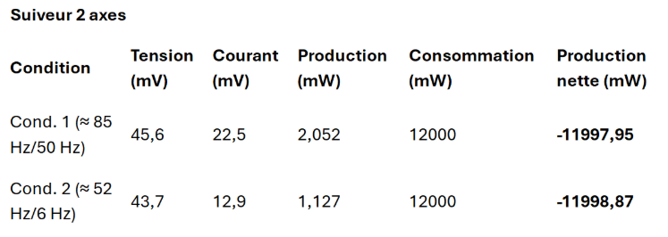

# Étude de cas : Analyse de la production énergétique, des pertes et de la rentabilité

## Contexte du système

Notre projet repose sur un suiveur solaire bi-axes visant à optimiser la production d’un panneau solaire monocristallin de 3W. Le mouvement est assuré par deux moteurs :

· Un moteur pas à pas 180° pour l’axe Y (orientation horizontale),

· Un moteur continu pour l’axe Z (inclinaison verticale).

L’électricité produite transite par un slipring multibrin, nécessaire à la rotation continue sans torsion des câbles, mais qui s’est avéré problématique.

---

## Objectif expérimental

L’objectif était de comparer trois configurations :

1. Deux panneaux fixes à plat (0°)

2. Deux panneaux fixes à 45° d’inclinaison

3. Deux panneaux montés sur le suiveur motorisé à deux axes

---

## Résultats expérimentaux :

Panneaux fixes à plat (0°)

Condition Tension AC RMS (mV) Courant AC RMS (mV) Puissance totale (mW)

Panneaux fixes à 45°

Condition Tension AC (mV) Courant AC (mV) Panneau 1 (mW) 2 Panneaux (mW)

Suiveur 2 axes

Condition Tension (mV) Courant (mV) Production (mW) Consommation (mW) Production nette (mW)

---

## Analyse des résultats

· La production brute du suiveur est comparable aux panneaux fixes à 45°, ce qui signifie que le système oriente correctement les panneaux.

· Cependant, la consommation électrique des moteurs (≈ 12 W) est largement supérieure à la production solaire du panneau (≈ 2 mW).

· Le bilan énergétique net est donc fortement négatif (environ -12 W), ce qui rend le système totalement non rentable dans cette configuration.

---

## Cause principale des pertes

L’élément déterminant dans ces pertes est le slipring :

· Il génère une chute de tension,

· Fait perdre jusqu’à 50 % de la puissance du panneau,

· Introduit du bruit électrique et des contacts instables,

· N’est pas adapté aux faibles puissances comme ici.

Le moteur continu sur l’axe Z, bien que fonctionnel, est responsable d’une consommation constante inutile, surtout pour une inclinaison qui n’a pas besoin d’être ajustée en temps réel.

---

## Réflexion sur la rentabilité

Dans notre configuration :

· Le système à deux axes consomme beaucoup plus qu’il ne produit,

· Les panneaux fixes à 45° atteignent quasiment la même production que le suiveur,

· Les gains théoriques ne justifient pas la complexité et la consommation du suivi.

Le système n’est donc pas rentable pour un petit panneau solaire de 3W. Il serait mieux adapté à une installation plus grande, avec des panneaux plus puissants et une électronique optimisée.

---

## Réponse à la problématique

Peut-on améliorer significativement la production d’énergie solaire grâce à un système de suivi motorisé, sans que cela rende le système non rentable ?

Oui, mais uniquement si le rapport entre production et consommation est favorable. Dans notre cas, non, le système à deux axes n’est pas rentable. Le gain de production est insuffisant pour compenser :

· Les pertes dans les composants comme le slipring,

· La consommation des moteurs,

· La complexité d’un système dynamique.

---

## Conclusion

Notre expérience montre qu’un système de suivi solaire peut théoriquement améliorer la captation de lumière, mais que la rentabilité dépend fortement de la balance entre production et consommation. Un suiveur à un seul axe et sans slipring, avec une orientation simple (par exemple Est-Ouest), serait probablement plus adapté à ce type de panneau.