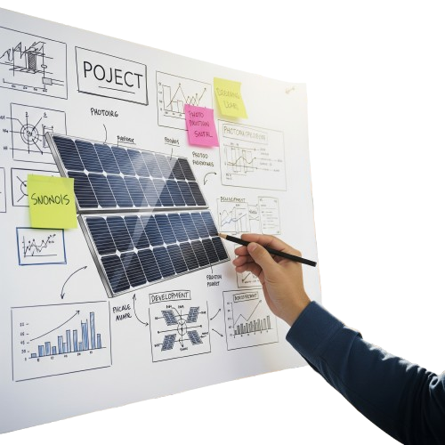
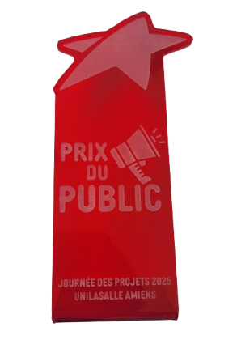

# Bienvenue sur notre documentation

Bienvenue dans la documentation du projet Suiveur Solaire. Ce site a pour but de fournir toutes les informations nécessaires pour comprendre, utiliser et reproduire efficacement notre projet.

## À propos du Projet

# Problématique

L'utilisation d'un suiveur solaire permet-il d'augmenter le rendement d'un panneau photovoltaïque afin d'améliorer leur attractivité ?

# Projet - Suiveur de Panneau Solaire 

Ce projet propose de concevoir un suiveur de panneau solaire à l’aide d’un système motorisé permettant d’optimiser l’orientation d’un panneau en fonction de la position du soleil. L’objectif est d’expérimenter et d’évaluer l’efficacité énergétique d’un tel système par rapport à l’utilisation de deux panneaux fixes orientés dans des directions opposées.

Catégorie : 

Projets I3 2025

Groupe : Dimanche Alex, Drapich Nicolas, Tromeur Anton, Carel Romain

Durant la journée des projets nous avons présenté notre Suiveur Solaire pour la première fois. Nous avons expliqué son fonctionnement avec la maquette. Puis, à l'aide d'un projecteur, nous avons simulé le passage du Soleil qui est suivi par le panneau solaire.

---

Notre projet a remporté le Prix du Vote du Public à cette occasion !

## Poster

## Vidéo

Ici vous publierez la vidéo de votre projet. 
- Moins de 1min30
- Présentation du projet 
- Des explication du fonctionnement du projet
- Des vues du projet / Prototype / Application etc... 
- Des plans du fonctionnement (même basique ou des éléments séparés)
- Une conclusion
- Si en stockage local : <50mo

<video src="images/intro_amiens.mp4" controls title="Title"  style="width: 100%;"></video>

---

  

