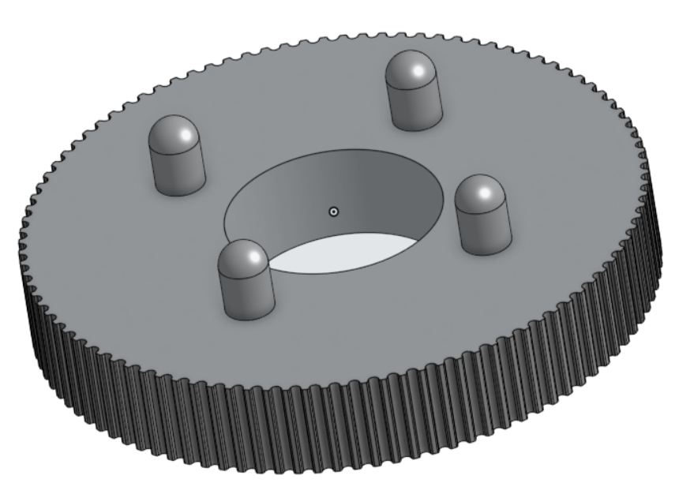

[Retour](partie_mécanique.md)  

# Modélisation

## Plateau pour panneau photovoltaïque

Plateau dans lequel le panneau photovoltaïque est inséré.

---

## Support du plateau

Support situé en dessous du plateau.

---

## Cache lumineux

Cache pour bloquer la lumière venant dans la direction opposée à la photorésistance.

---

## Engrenages de rotation

Engrenages permettant de faire tourner le panneau sur 360°.

---

## Fixation des moteurs

Accroche pour maintenir les moteurs en place.

---

## Support principal

Les supports sont attachés à la base pour assurer la stabilité de l’ensemble.

---

## Plaque

Plaque d'acrylique qui soutient le système

---

[Retour](partie_mécanique.md)