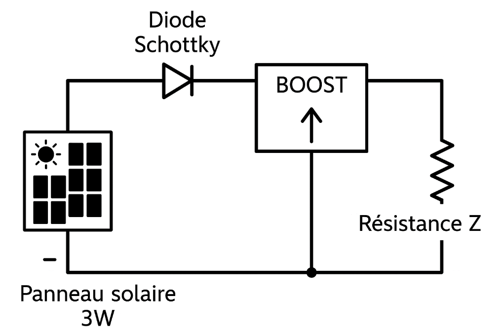

# Partie Electrique
---

[Voir photorésistance](photores.md)

[Voir cellule photovoltaïque](cellule_ph.md)

Schéma du circuit de production de l'électricité. Il est tout d'abord composé de la cellule photovoltaïque 3W. La diode schottky empêche le retour du courant dans le panneau, et le convertisseur hacheur buck boost augmente la tension pour s'adapter à la charge (ici 5V).