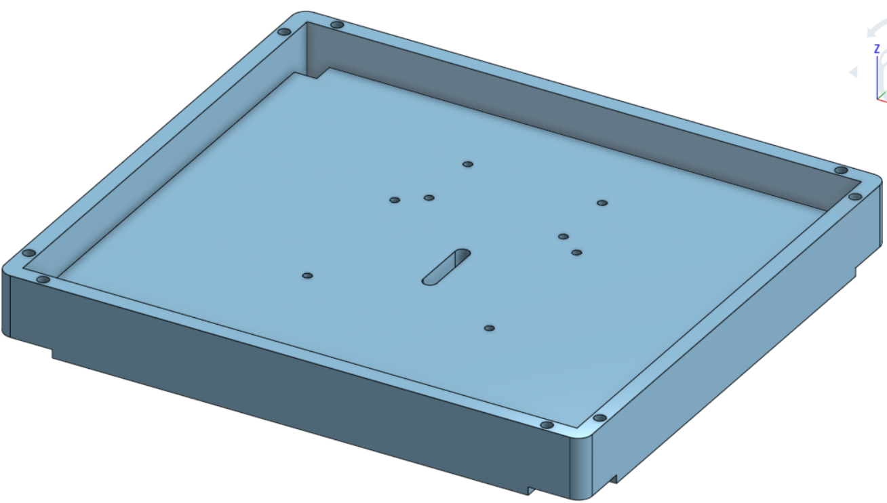
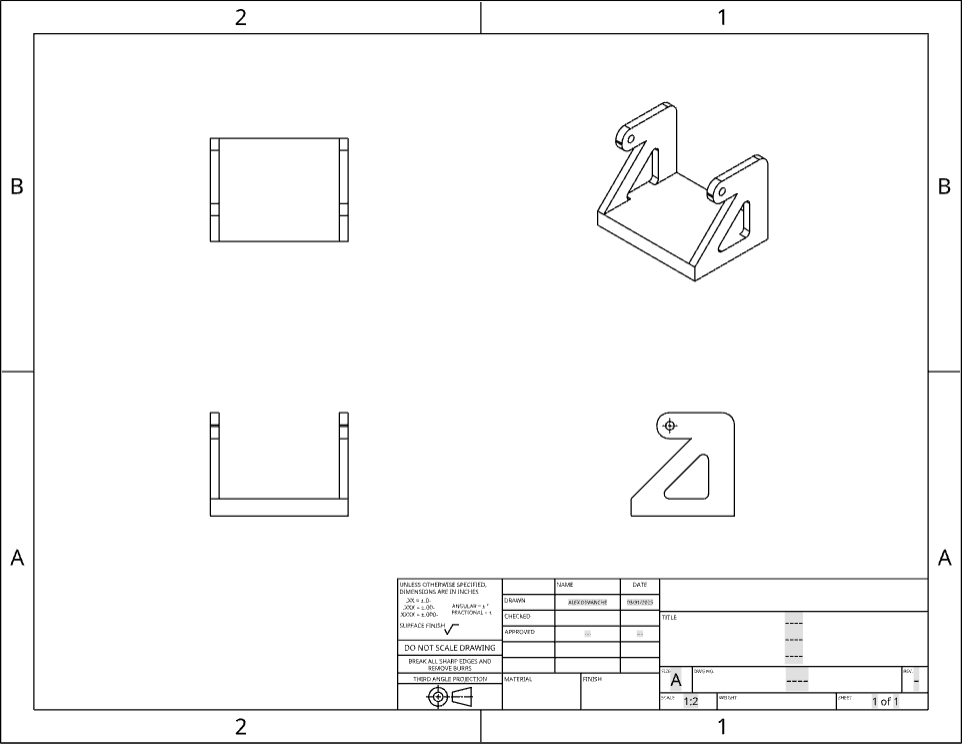
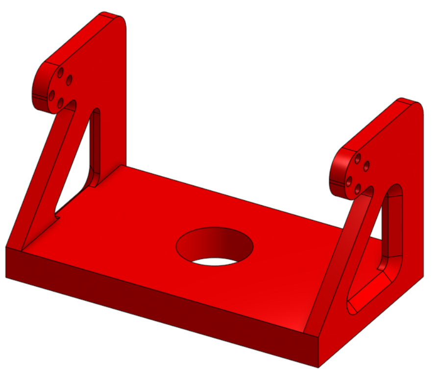
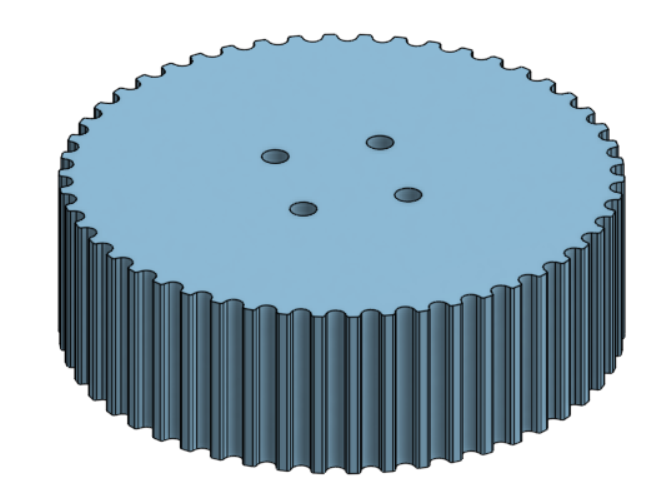
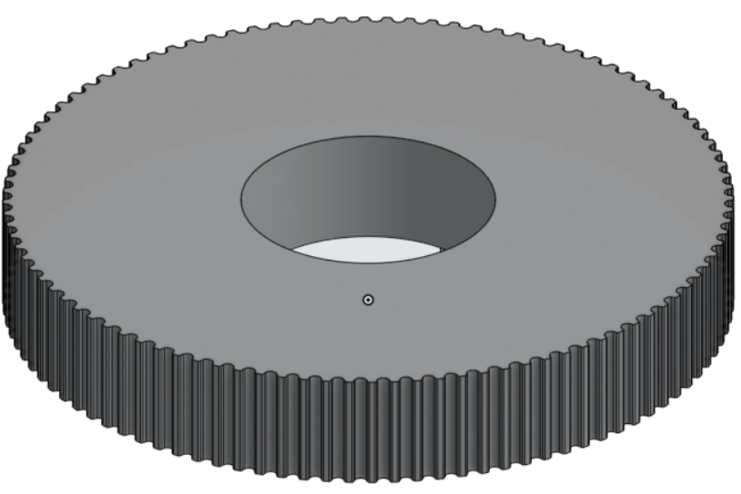
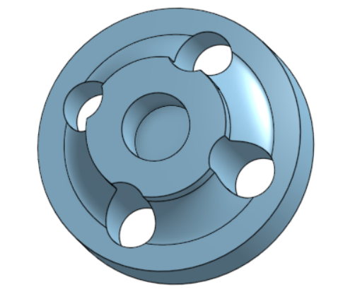
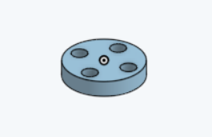
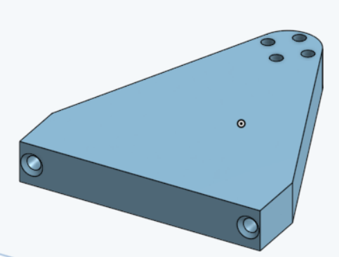

[Retour](partie_mécanique.md)

[Page principale](README.md)

<h1>Modélisation</h1>

Plateau dans lequel le panneau photovoltaïque est inséré

Support se situant en dessous du plateau

Cache pour bloquer la lumière venant dans la direction opposée à la photorésistance

Engrenages permettant de tourner le panneau sur 360°

Accroche pour les moteurs

Support

[Retour](partie_mécanique.md)

[Page principale](README.md)
