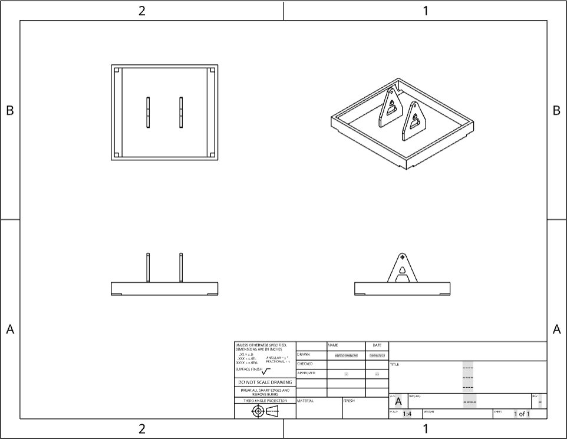

<!-- Liens de navigation -->

  <a href="partie_mécanique.md" style="margin-right: 15px;">🔙 Retour</a>
  <a href="README.md">🏠 Page principale</a>

<!-- Titre principal -->
<h1 style="color: #2c3e50; font-family: Arial, sans-serif;">🔧 Modélisation du Système</h1>

<!-- Plateau -->
<h2 style="color: #34495e;">Plateau pour panneau photovoltaïque</h2>

Plateau dans lequel le panneau photovoltaïque est inséré.

<!-- Support du plateau -->
<h2 style="color: #34495e;">Support du plateau</h2>

Support situé en dessous du plateau pour le maintenir en position.

<!-- Cache de lumière -->
<h2 style="color: #34495e;">Cache lumineux</h2>

Cache pour bloquer la lumière venant dans la direction opposée à la photorésistance.

<!-- Engrenages -->
<h2 style="color: #34495e;">Système d’engrenages</h2>

Engrenages permettant une rotation à 360° du panneau.

<!-- Tenue moteur -->
<h2 style="color: #34495e;">Fixation des moteurs</h2>

Éléments permettant de fixer solidement les moteurs.

<!-- Support de base -->
<h2 style="color: #34495e;">Support principal</h2>

Les supports sont attachés à la base pour assurer la stabilité de l'ensemble.

<!-- Liens de navigation en bas -->

  <a href="partie_mécanique.md" style="margin-right: 15px;">🔙 Retour</a>
  <a href="README.md">🏠 Page principale</a>

