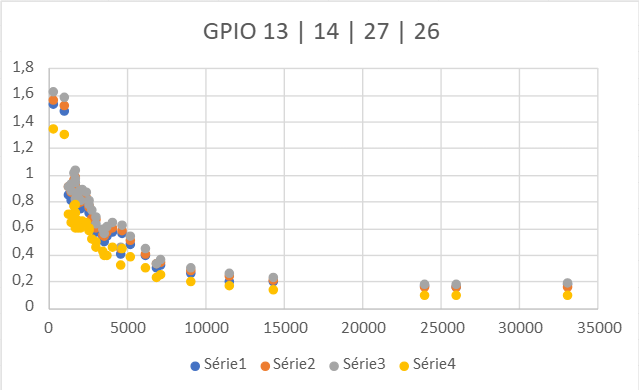
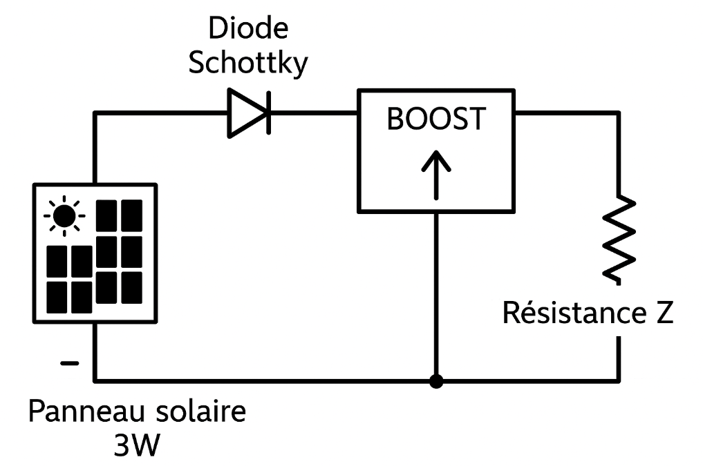

[Retour](README.md)

Partie électrique :

Premiers tests des différentes photorésistances que nous avons obtenues. On peut observer que la photorésistance jaune possède des valeurs inférieures aux autres, nous avons donc décidé d'en utiliser une autre.

Schéma du circuit de production de l'électricité. Il est tout d'abord composé de la cellule photovoltaïque 3W. La diode schottky empêche le retour du courant dans le panneau, et le convertisseur hacheur buck boost augmente la tension pour s'adapter à la charge (ici 5V).

[Retour](README.md)
