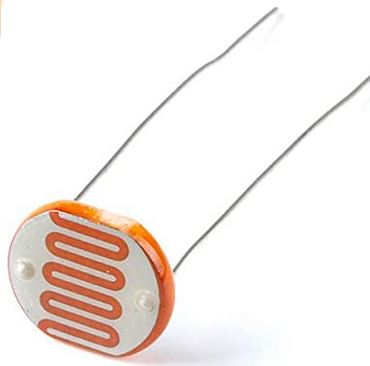

[Retour](partie_électrique.md)

[Page principale](README.md)

<h1>Photorésistances</h1>

LDR au CdS présentant une résistance > 10 MΩ dans l'obscurité. 

Cette résistance chute à 75...300 Ω lors de l'exposition à la lumière. 

<b>Caractéristiques :</b>

Diamètre : 10 mm 

Vitesse de variation : > 200 kΩ/s 

<h1>Tests des photorésistances</h1>

Premiers tests des différentes photorésistances que nous avons obtenues. On peut observer que la photorésistance jaune possède des valeurs inférieures aux autres, nous avons donc décidé d'en utiliser une autre.

[Retour](partie_électrique.md)

[Page principale](README.md)
